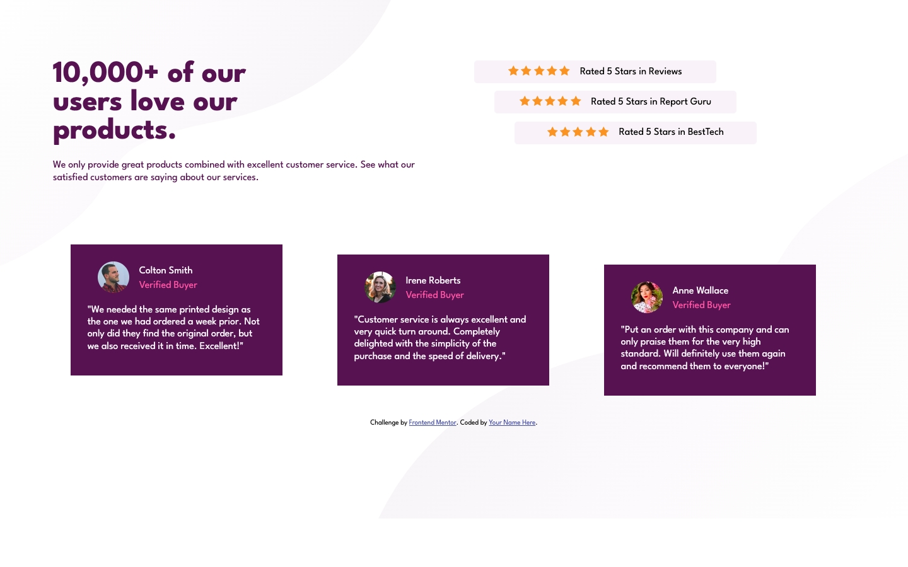
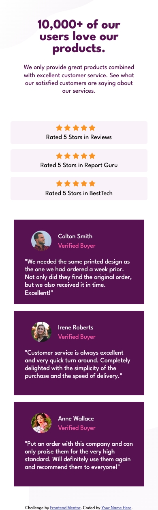

# Frontend Mentor - Social proof section solution

This is a solution to the [Social proof section challenge on Frontend Mentor](https://www.frontendmentor.io/challenges/social-proof-section-6e0qTv_bA). Frontend Mentor challenges help you improve your coding skills by building realistic projects. 

## Table of contents

- [Overview](#overview)
  - [The challenge](#the-challenge)
  - [Screenshot](#screenshot)
  - [Links](#links)
- [My process](#my-process)
 
- [Author](#author)

**Note: Delete this note and update the table of contents based on what sections you keep.**

## Overview

### The challenge

Users should be able to:

- View the optimal layout for the section depending on their device's screen size

### Screenshot

- Desktop screenshot:
- Mobile screenshot:

### Links

- Solution URL: [Solution repo](https://github.com/naglorias/social-proof-section.git)
- Live Site URL: [Live Site](https://naglorias.github.io/social-proof-section/)

## My process

### Built with

- Semantic HTML5 markup
- CSS custom properties
- Flexbox
- CSS Grid
- Mobile-first workflow

**Note: These are just examples. Delete this note and replace the list above with your own choices**

## Author

- Website - [Github profile](https://github.com/naglorias)
- Frontend Mentor - [@naglorias](https://www.frontendmentor.io/profile/naglorias)
- Twitter - [@naglaaS_](https://twitter.com/naglaaS_)

**Note: Delete this note and add/remove/edit lines above based on what links you'd like to share.**
